#mybooks-uts

HEROKU LINK : https://mybooks-web-app.herokuapp.com

TAMPILAN AWAL
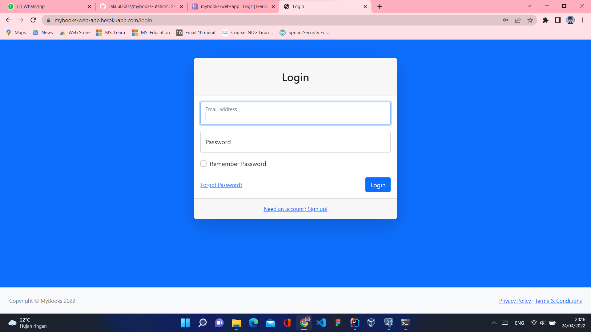 "Tampilan Awal Website"

CREATE NEW ACCOUNT
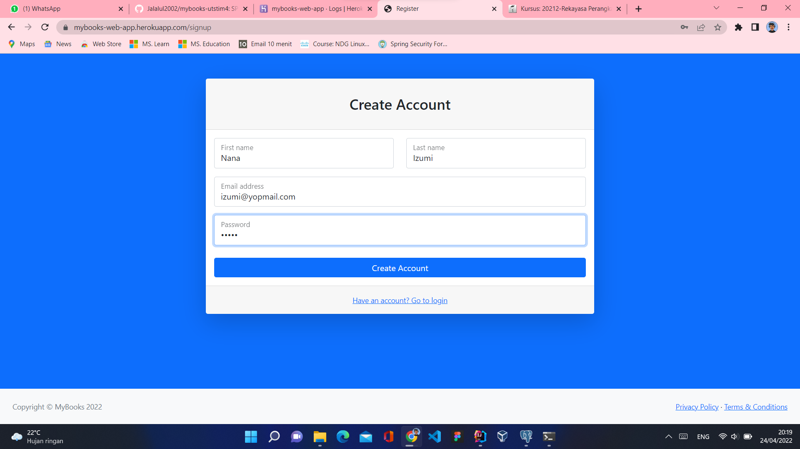 "Membuat Akun Baru"

CREAT NEW ACCOUNT SUCCESS
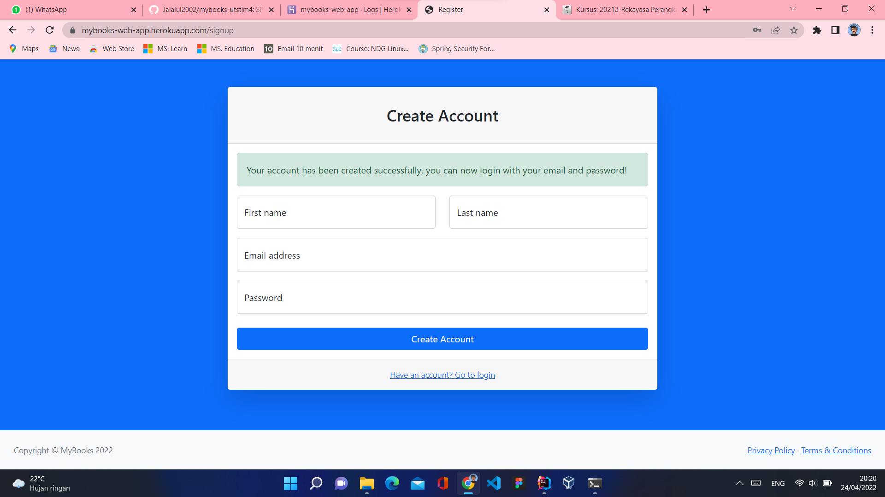 "Membuat Akun Baru - Success"

LOGIN
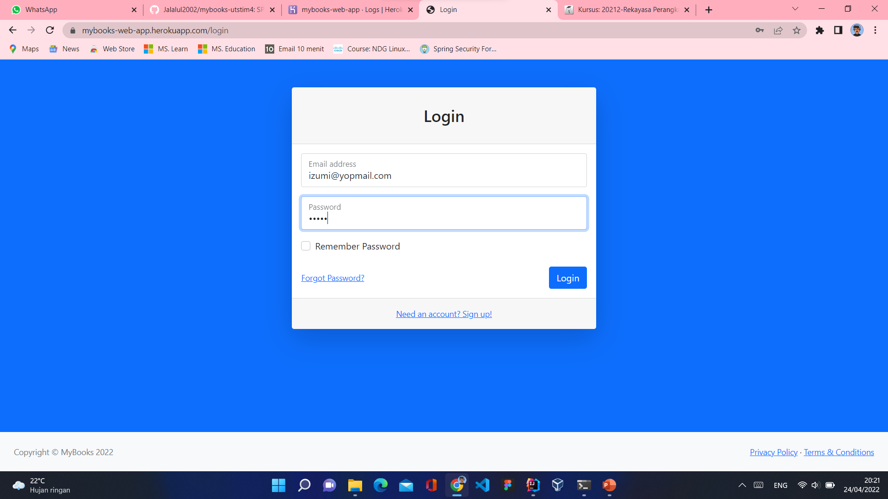 "Login View Website"

DASHBOARD
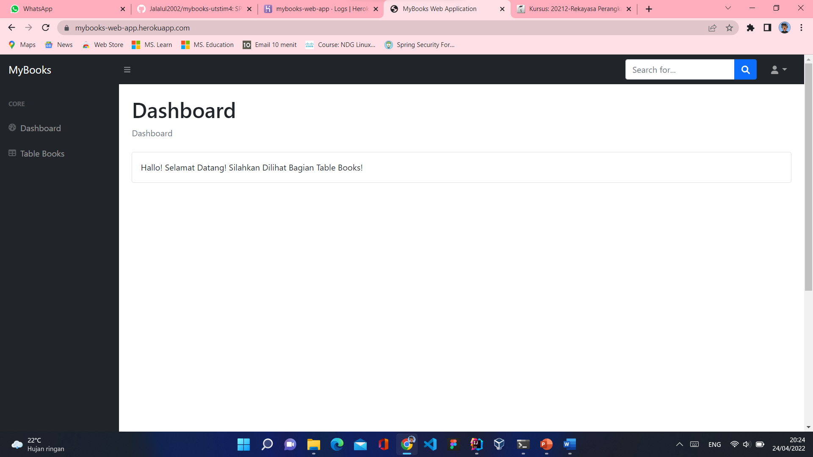 "Tampilan Dashboard"

TABLE BOOKS
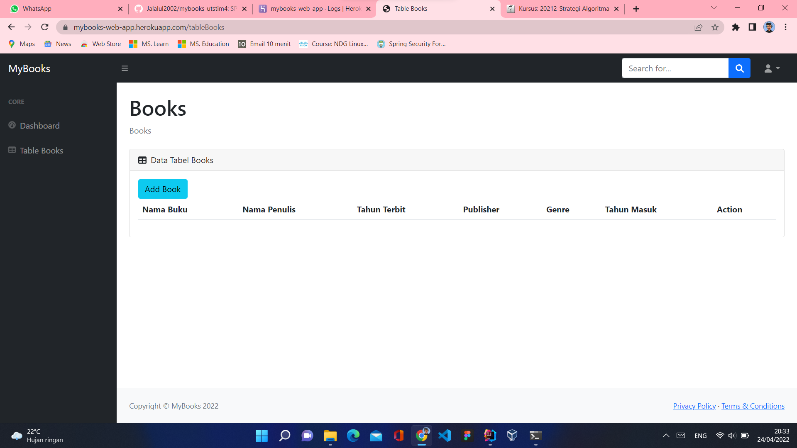 "Tampilan Tabel Data Buku"

ADD NEW BOOK
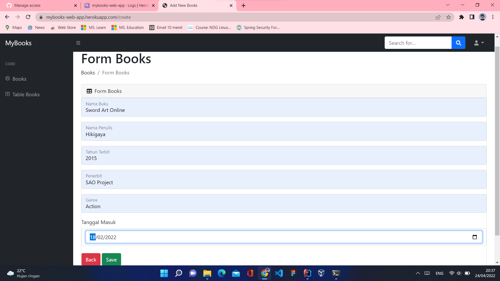 "Tampilan Form Tambah Buku"

ADD NEW BOOK SUCCESS
 "Tampilan Tabel Data Buku Setelah Ditambah Data"

EDIT BOOK
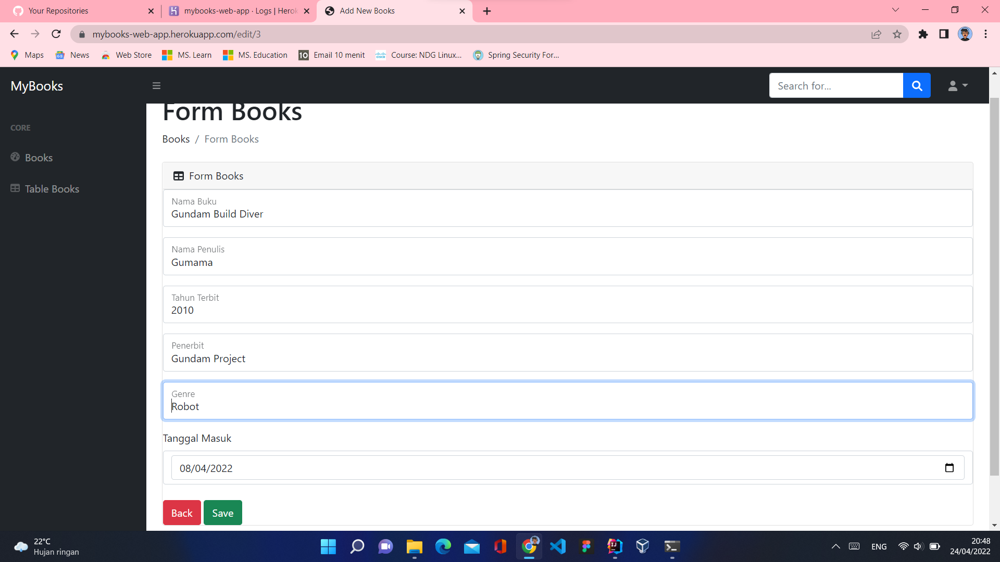 "Tampilan Edit Data Buku"

DELETE or REMOVE
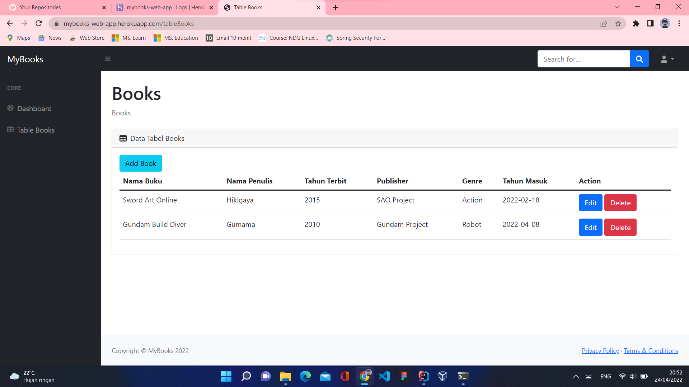 "Tampilan Setelah 1 Data Dihapus"

LOGOUT
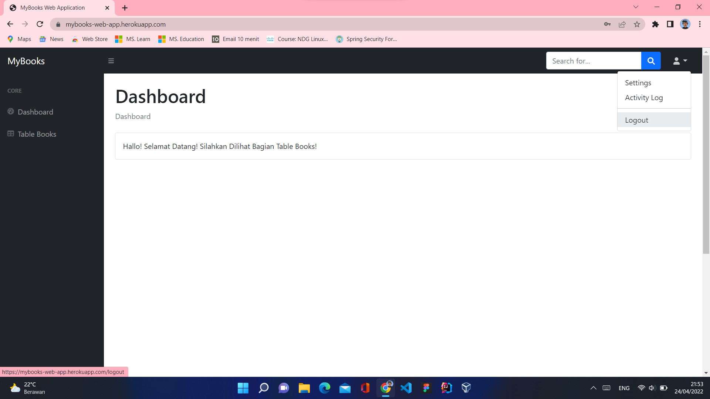 "Tampilan Button Logout"

LOGOUT-SUCCESS
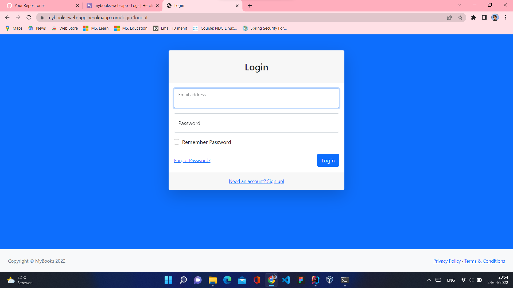 "Tampilan Setelah Button Logout di Klik"

FORGOT PASSWORD
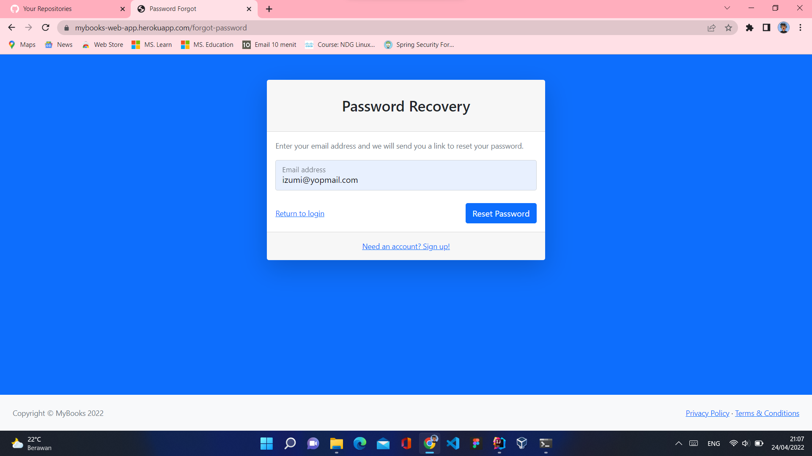 "Tampilan Form Forgot Password"

TOKEN SENDED TO EMAIL
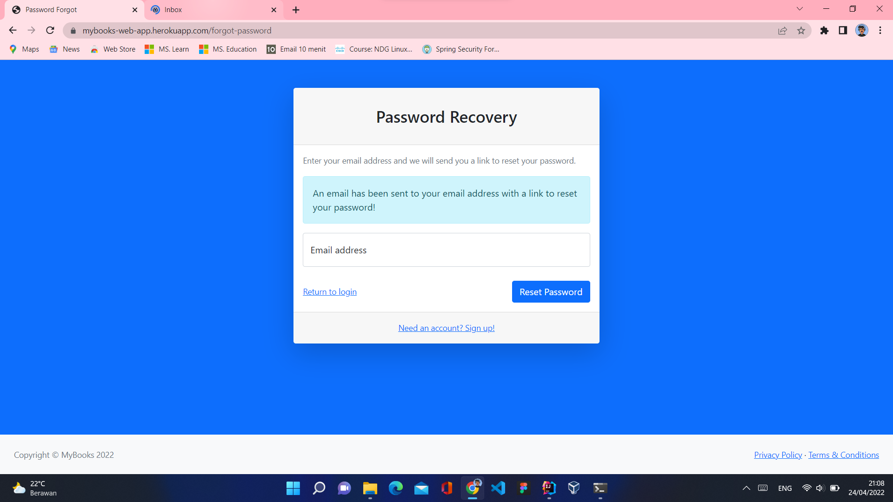 "Tampilan Token Untuk Reset Password Terkirim Lewat Email"

EMAIL
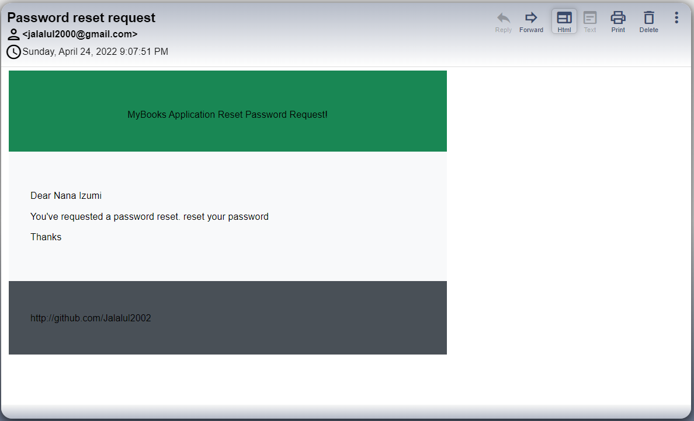 "Tampilan Email Request Token and Reset Password"

RESET PASSWORD
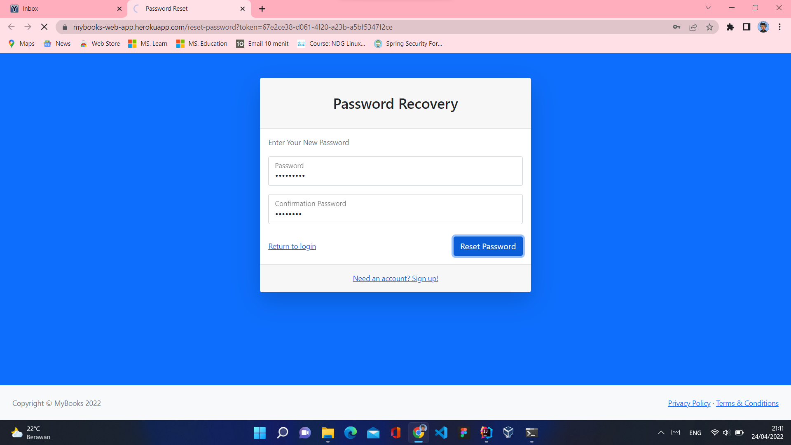 "Tampilan Reset Password"

TAMPILAN DI LOCALHOST
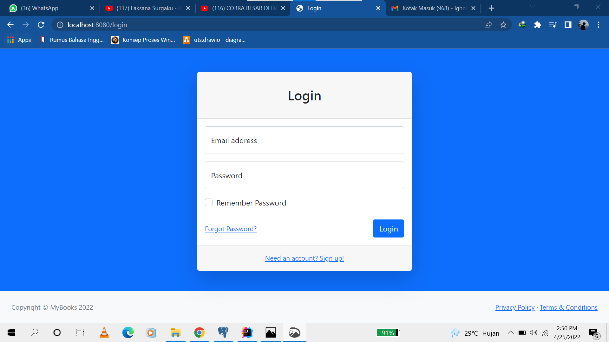 "Tampilan Login"

CREATE NEW ACCOUNT
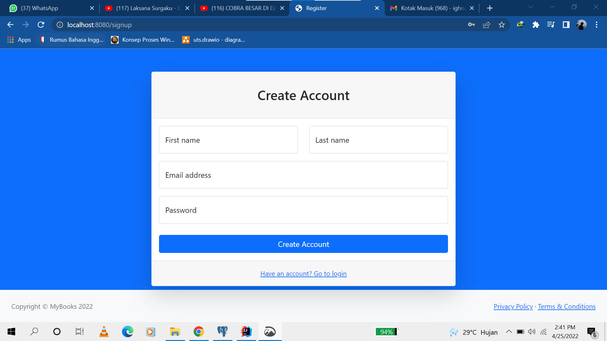 "Tampilan Membuat Akun"

CREATE NEW ACCOUNT 
![ACCOUNT] (img/22.png) "Membuat Akun Baru"

LOGIN
![LOGIN] (img/23.png) "Login"

DASHBOARD
![DASHBOARD] (img/24.png) "Dashboard"

ADD BOOK
![BOOK] (img/25.png) "Menambahkan Buku"

FORM BOOK
![FORMB] (img/26.png) "Menambah List Buku"

SUCCES ADD BOOK
![SUCC] (img/27.png) "Sukses Menambah List Buku"

PASSWORD FORGET
![PASS] (img/28.png) "Lupa Kata Sandi"

ERROR
![ERR] (img/29.png) "Error"
